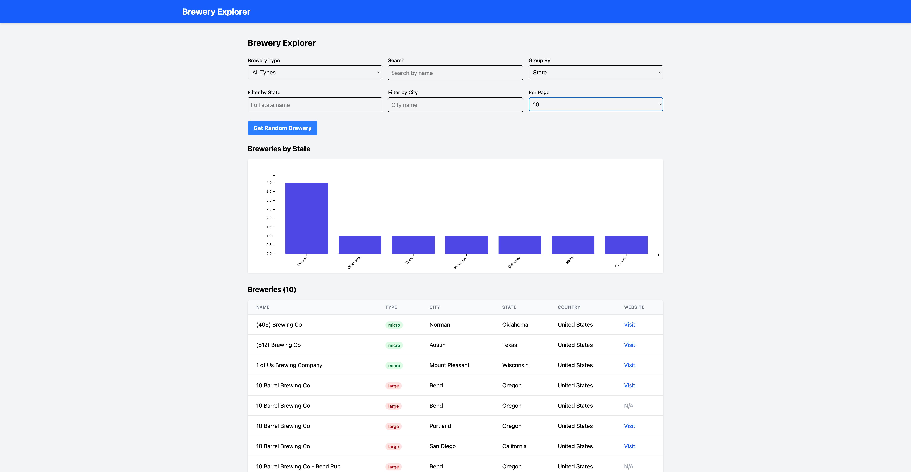

# Brewery Explorer

A full-stack application for exploring breweries using the Open Brewery DB API. Built with Django, Vue.js, and D3.js for data visualization.



## Table of Contents
- [Features](#features)
- [Tech Stack](#tech-stack)
- [Project Structure](#project-structure)
- [Installation](#installation)
- [Usage](#usage)
- [Testing](#testing)
- [API Endpoints](#api-endpoints)
- [Design Decisions](#design-decisions)
- [Deployment](#deployment)
- [License](#license)

## Features

- **Browsing**: View and explore breweries from the Open Brewery DB
- **Filtering**: Filter by type, name, city, and state
- **Search**: Full text search functionality
- **Random Brewery**: Discover random breweries
- **Data Visualization**: Interactive charts grouped by brewery type, state, or city
- **Responsive Design**: Mobile-friendly UI

## Tech Stack

### Backend
- Django 4.2.7
- Django REST Framework 3.14.0
- Python 3.8+

### Frontend
- Vue.js 3
- Tailwind CSS
- D3.js for data visualization
- Axios for HTTP requests

### DevOps
- Docker for containerization
- Pytest for backend testing
- Vitest for frontend testing

## Project Structure

```
brewery-explorer/
│
├── backend/               # Django backend
│   ├── brewery_api/       # Django app
│   │   ├── services/      # API service layer
│   │   ├── tests/         # Backend tests
    │   │   ├── services_test.py
    │   │   └── views_test.py
│   │   ├── views.py       # API views
│   │   └── urls.py        # API routes
│   ├── brewery_project/   # Django project settings
│   ├── Dockerfile         # Backend container
│   └── requirements.txt   # Python dependencies
│
└── frontend/              # Vue.js frontend
    ├── public/            # Static assets
    ├── src/               # Vue source files
    │   ├── components/    # Vue components
    │   ├── services/      # API services
    │   └── __tests__/     # Frontend tests
    ├── Dockerfile         # Frontend container
    └── package.json       # JS dependencies
```

## Installation

### Prerequisites
- Python 3.8+
- Node.js 16+
- npm or yarn
- Docker (optional)

### Backend Setup

```bash
# Clone repository
git clone https://github.com/chrisdamba/brewery-explorer.git
cd brewery-explorer/backend

# Create virtual environment
python -m venv env
source env/bin/activate  # On Windows: env\Scripts\activate

# Install dependencies
pip install -r requirements.txt

# Run migrations
python manage.py migrate

# Start development server
python manage.py runserver
```

### Frontend Setup

```bash
# In a new terminal, navigate to frontend directory
cd brewery-explorer/frontend

# Install dependencies
npm install

# Start development server
npm run dev
```

### Docker Setup (Alternative)

```bash
# Build and start containers
docker-compose up -d

# View logs
docker-compose logs -f
```

## Usage

1. Open your browser and navigate to:
   - Frontend: http://localhost:5173/
   - Backend API: http://localhost:8000/api/breweries/

2. Use the search and filter options to find breweries
3. Group data by type, state, or city to visualize brewery distribution
4. Click "Get Random Brewery" to discover new breweries

## Testing

### Backend Tests

```bash
cd backend
pytest
# or
python manage.py test
```

### Frontend Tests

```bash
cd frontend
npm run test
```

## API Endpoints

| Endpoint | Method | Description |
|----------|--------|-------------|
| `/api/breweries/` | GET | List all breweries with optional filters |
| `/api/breweries/{id}/` | GET | Get a specific brewery by ID |
| `/api/breweries/search/` | GET | Search breweries by keyword |
| `/api/breweries/random/` | GET | Get random brewery(ies) |

### Query Parameters

- `by_type`: Filter by brewery type (micro, nano, regional, etc.)
- `by_state`: Filter by state
- `by_city`: Filter by city
- `by_name`: Filter by name
- `group_by`: Group results by attribute (brewery_type, state, city)
- `page`: Page number for pagination
- `per_page`: Number of results per page (default: 50, max: 200)

## Design Decisions

### Service Layer Pattern
The backend implements a service layer pattern to abstract the Open Brewery DB API. This provides several benefits:
- Clear separation of concerns
- Easier testing with mock data
- Future-proofing against API changes
- Potential for caching frequently requested data

### Direct API Integration
The frontend makes direct calls to our Django backend, which then interacts with the Open Brewery DB API. This architecture:
- Keeps the API implementation details hidden from the frontend
- Allows for server-side enhancements like caching and data processing
- Provides a consistent API interface, even if the upstream API changes

### Data Visualization with D3.js
D3.js was chosen for data visualization because:
- It provides powerful, flexible, and customizable charts
- It works well with dynamic data
- It offers interactive features like hover effects

## Deployment

### Fly.io Deployment
Detailed instructions for deploying to Fly.io:

1. Install Flyctl: `curl -L https://fly.io/install.sh | sh`
2. Login: `fly auth login`
3. Launch apps:
   ```bash
   # Deploy backend
   cd backend
   fly launch --name brewery-explorer-api
   
   # Deploy frontend
   cd ../frontend
   fly launch --name brewery-explorer
   ```

## License

MIT License